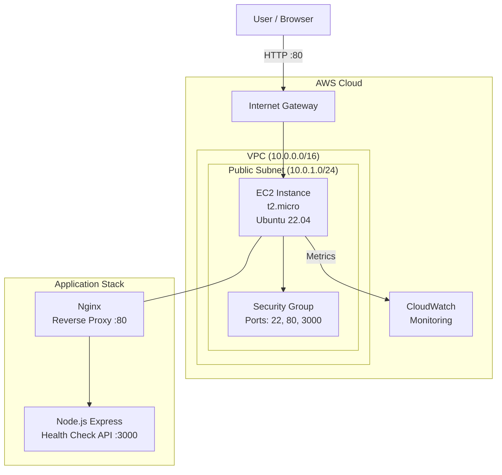

# Cloud Infrastructure Exploration Lab

[](LICENSE)
[](#)
[](#)
[](#)

A hands-on lab environment for exploring cloud infrastructure fundamentals — from provisioning virtual machines and configuring networking to deploying applications and setting up monitoring. Designed for engineers, DevOps practitioners, and anyone looking to gain practical cloud computing skills through real-world exercises.

---

## Table of Contents

- [Overview](#overview)
- [Architecture](#architecture)
- [Prerequisites](#prerequisites)
- [Lab Exercises](#lab-exercises)
  - [Lab 1: Cloud Account Setup](#lab-1-cloud-account-setup)
  - [Lab 2: Provisioning Virtual Machines](#lab-2-provisioning-virtual-machines)
  - [Lab 3: Networking Configuration](#lab-3-networking-configuration)
  - [Lab 4: Application Deployment](#lab-4-application-deployment)
  - [Lab 5: Monitoring and Observability](#lab-5-monitoring-and-observability)
  - [Lab 6: Infrastructure as Code](#lab-6-infrastructure-as-code)
- [Quick Start](#quick-start)
- [Project Structure](#project-structure)
- [Troubleshooting](#troubleshooting)
- [Further Reading](#further-reading)
- [License](#license)

---

## Overview

This lab provides a structured, progressive learning path through cloud infrastructure concepts. Each exercise builds upon the previous one, culminating in a fully deployed and monitored web application running on cloud infrastructure provisioned entirely through code.

**What you'll learn:**
- Setting up and navigating AWS/Azure cloud consoles
- Provisioning and managing virtual machines (EC2 / Azure VMs)
- Configuring Virtual Private Clouds (VPCs), subnets, and security groups
- Deploying a Node.js web application to a cloud VM
- Setting up basic monitoring dashboards
- Writing Terraform scripts to automate infrastructure provisioning

---

## Architecture



---

## Prerequisites

### Accounts
- **AWS Free Tier** account — [Sign up here](https://aws.amazon.com/free/)
- **GitHub** account (for version control)

### Tools to Install
| Tool | Version | Purpose |
|------|---------|---------|
| [Terraform](https://www.terraform.io/downloads) | >= 1.5.0 | Infrastructure as Code |
| [AWS CLI](https://aws.amazon.com/cli/) | >= 2.x | AWS resource management |
| [Node.js](https://nodejs.org/) | >= 18.x | Application runtime |
| [Git](https://git-scm.com/) | >= 2.x | Version control |
| [SSH Client](https://www.openssh.com/) | Any | Remote server access |

### AWS Setup
```bash
# Configure AWS CLI with your credentials
aws configure
# Enter: Access Key ID, Secret Access Key, Region (us-east-1), Output (json)
```

---

## Lab Exercises

### Lab 1: Cloud Account Setup
Set up your AWS Free Tier account and configure CLI access. See [docs/LAB_GUIDE.md](docs/LAB_GUIDE.md#lab-1) for detailed steps.

### Lab 2: Provisioning Virtual Machines
Launch an EC2 instance manually through the AWS Console, then connect via SSH. See [docs/LAB_GUIDE.md](docs/LAB_GUIDE.md#lab-2).

### Lab 3: Networking Configuration
Create a VPC, public subnet, internet gateway, and security groups. See [docs/LAB_GUIDE.md](docs/LAB_GUIDE.md#lab-3).

### Lab 4: Application Deployment
Deploy the included Express.js health-check server on your EC2 instance. See [docs/LAB_GUIDE.md](docs/LAB_GUIDE.md#lab-4).

### Lab 5: Monitoring and Observability
Set up CloudWatch alarms and dashboards to monitor your instance. See [docs/LAB_GUIDE.md](docs/LAB_GUIDE.md#lab-5).

### Lab 6: Infrastructure as Code
Use the included Terraform scripts to automate everything from Labs 2-4. See [docs/LAB_GUIDE.md](docs/LAB_GUIDE.md#lab-6).

---

## Quick Start

```bash
# Clone the repository
git clone https://github.com/yourusername/cloud-infra-lab.git
cd cloud-infra-lab

# Option A: Manual deployment (follow the Lab Guide)
# See docs/LAB_GUIDE.md

# Option B: Automated with Terraform
cd terraform
cp terraform.tfvars.example terraform.tfvars
# Edit terraform.tfvars with your values

terraform init
terraform plan
terraform apply

# SSH into your instance
ssh -i your-key.pem ubuntu@$(terraform output -raw public_ip)

# Deploy the application
cd ~/
bash setup.sh
```

---

## Project Structure

```
cloud-infra-lab/
├── README.md                  # This file
├── LICENSE                    # MIT License
├── .gitignore                 # Git ignore rules
├── .editorconfig              # Editor formatting rules
├── terraform/
│   ├── main.tf                # Main infrastructure configuration
│   ├── variables.tf           # Input variables
│   └── outputs.tf             # Output values
├── app/
│   ├── server.js              # Express.js health-check server
│   └── package.json           # Node.js dependencies
├── scripts/
│   ├── setup.sh               # VM setup and app deployment script
│   └── monitor.sh             # Health check monitoring script
└── docs/
    ├── LAB_GUIDE.md           # Complete lab walkthrough
    ├── ARCHITECTURE.md        # Architecture explanation
    └── screenshots/
        └── SCREENSHOTS.md     # Screenshot descriptions
```

---

## Troubleshooting

### Cannot SSH into EC2 instance
- Verify your security group allows inbound traffic on port 22
- Check that your key pair file has correct permissions: `chmod 400 your-key.pem`
- Ensure the instance is in a public subnet with an internet gateway attached

### Terraform apply fails
- Run `terraform init` to ensure providers are downloaded
- Verify your AWS credentials are configured: `aws sts get-caller-identity`
- Check that your IAM user has EC2, VPC, and CloudWatch permissions

### Application not accessible on port 80
- Verify Nginx is running: `sudo systemctl status nginx`
- Check security group allows inbound traffic on port 80
- Verify the Node.js app is running: `pm2 status` or `curl localhost:3000`

### CloudWatch metrics not appearing
- Metrics can take 5-10 minutes to appear in the dashboard
- Ensure the EC2 instance has the CloudWatch agent installed
- Verify the instance IAM role has CloudWatch permissions

---

## Further Reading

- [AWS Well-Architected Framework](https://aws.amazon.com/architecture/well-architected/)
- [Terraform AWS Provider Documentation](https://registry.terraform.io/providers/hashicorp/aws/latest/docs)
- [AWS VPC User Guide](https://docs.aws.amazon.com/vpc/latest/userguide/)
- [Nginx Reverse Proxy Configuration](https://docs.nginx.com/nginx/admin-guide/web-server/reverse-proxy/)
- [CloudWatch User Guide](https://docs.aws.amazon.com/AmazonCloudWatch/latest/monitoring/)
- [The Twelve-Factor App](https://12factor.net/)

---

## License

This project is licensed under the MIT License. See [LICENSE](LICENSE) for details.
