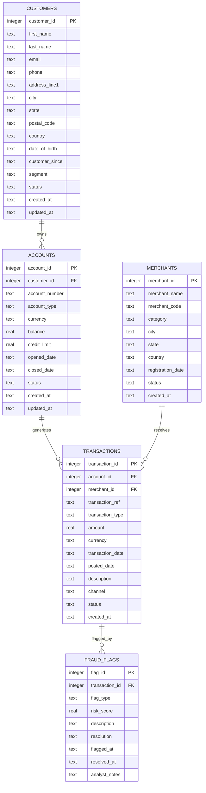

# Financial Data Manager

A production-grade data engineering toolkit for managing financial transaction data, executing analytical queries, and enforcing data quality standards across a relational data warehouse.

## Overview

Financial Data Manager provides a complete pipeline for:

- **Schema management** -- versioned SQLite schema with referential integrity constraints
- **Synthetic data generation** -- realistic financial data seeded via Faker for development and testing
- **Analytical SQL queries** -- 20 pre-built queries covering revenue analysis, fraud detection, merchant insights, and reconciliation
- **Data quality framework** -- 10 automated checks spanning completeness, uniqueness, validity, consistency, and timeliness
- **Reporting** -- Markdown and HTML data quality reports with pass/fail summaries

## Entity-Relationship Diagram



## Quick Start

### Prerequisites

- Python 3.9+
- pip

### Installation

```bash
# Clone the repository
git clone <repo-url>
cd financial-data-manager

# Install dependencies
pip install -r requirements.txt
```

### Initialize and Seed

```bash
# Create database schema
python -m src.cli init-db

# Generate synthetic data (500 customers, 1000 accounts, 5000 transactions)
python -m src.cli seed

# Verify with a quick query
python -m src.cli query "SELECT COUNT(*) AS total_customers FROM customers"
```

### Run Analytics

```bash
# Execute any SQL query with formatted output
python -m src.cli query "SELECT segment, COUNT(*) AS cnt FROM customers GROUP BY segment ORDER BY cnt DESC"

# Run all data quality checks
python -m src.cli check-quality

# Generate a full DQ report (Markdown + HTML)
python -m src.cli report
```

## Example Queries

### Top 10 Customers by Transaction Volume

```sql
SELECT
    c.first_name || ' ' || c.last_name AS customer_name,
    COUNT(t.transaction_id) AS txn_count,
    ROUND(SUM(t.amount), 2) AS total_spent
FROM customers c
JOIN accounts a ON a.customer_id = c.customer_id
JOIN transactions t ON t.account_id = a.account_id
WHERE t.status = 'completed'
GROUP BY c.customer_id
ORDER BY total_spent DESC
LIMIT 10;
```

### Monthly Revenue Trend

```sql
SELECT
    strftime('%Y-%m', t.transaction_date) AS month,
    COUNT(*) AS txn_count,
    ROUND(SUM(t.amount), 2) AS revenue
FROM transactions t
WHERE t.transaction_type = 'purchase'
  AND t.status = 'completed'
GROUP BY month
ORDER BY month;
```

### Fraud Detection -- High-Risk Transactions

```sql
SELECT
    t.transaction_ref,
    t.amount,
    f.flag_type,
    f.risk_score,
    m.merchant_name
FROM fraud_flags f
JOIN transactions t ON t.transaction_id = f.transaction_id
JOIN merchants m ON m.merchant_id = t.merchant_id
WHERE f.risk_score > 0.8
ORDER BY f.risk_score DESC;
```

## Data Quality Framework

The built-in DQ framework evaluates data across five dimensions:

| Dimension     | Check                          | Description                                          |
|---------------|--------------------------------|------------------------------------------------------|
| Completeness  | Null check                     | Critical fields must not contain NULL values          |
| Uniqueness    | Duplicate detection            | Primary keys and natural keys must be unique          |
| Validity      | Format validation              | Emails, phone numbers, and codes match expected patterns |
| Consistency   | Referential integrity          | All foreign keys resolve to valid parent records      |
| Timeliness    | Date range validation          | Dates fall within acceptable business ranges          |
| Accuracy      | Amount outlier detection       | Transaction amounts within statistical thresholds     |

Run checks:

```bash
python -m src.cli check-quality
```

Generate a report:

```bash
python -m src.cli report
```

Reports are written to `reports/dq_report.md` and `reports/dq_report.html`.

## Project Structure

```
financial-data-manager/
├── src/
│   ├── __init__.py
│   ├── schema.py           # DDL statements and schema creation
│   ├── seed_data.py        # Synthetic data generation with Faker
│   ├── query_runner.py     # SQL execution and rich table display
│   ├── data_quality.py     # 10 automated DQ checks
│   ├── reporter.py         # Markdown and HTML report generation
│   └── cli.py              # Click-based CLI interface
├── queries/
│   ├── analytics.sql       # 20 pre-built analytical queries
│   └── README.md           # Business context for each query
├── tests/
│   ├── __init__.py
│   ├── test_schema.py      # Schema creation and constraint tests
│   └── test_quality.py     # Data quality check unit tests
├── docs/
│   ├── SCHEMA_GUIDE.md     # Detailed schema documentation
│   ├── SQL_REFERENCE.md    # SQL techniques reference
│   ├── DATA_QUALITY_FRAMEWORK.md
│   └── screenshots/
│       └── SCREENSHOTS.md
├── requirements.txt
├── .gitignore
├── LICENSE
└── README.md
```

## Configuration

The application uses sensible defaults but can be configured via environment variables:

| Variable          | Default                  | Description                    |
|-------------------|--------------------------|--------------------------------|
| `FDM_DB_PATH`     | `data/financial.db`      | SQLite database file path      |
| `FDM_REPORT_DIR`  | `reports/`               | Output directory for reports   |
| `FDM_SEED_LOCALE` | `en_US`                  | Faker locale for data generation |

## License

This project is licensed under the MIT License. See [LICENSE](LICENSE) for details.
