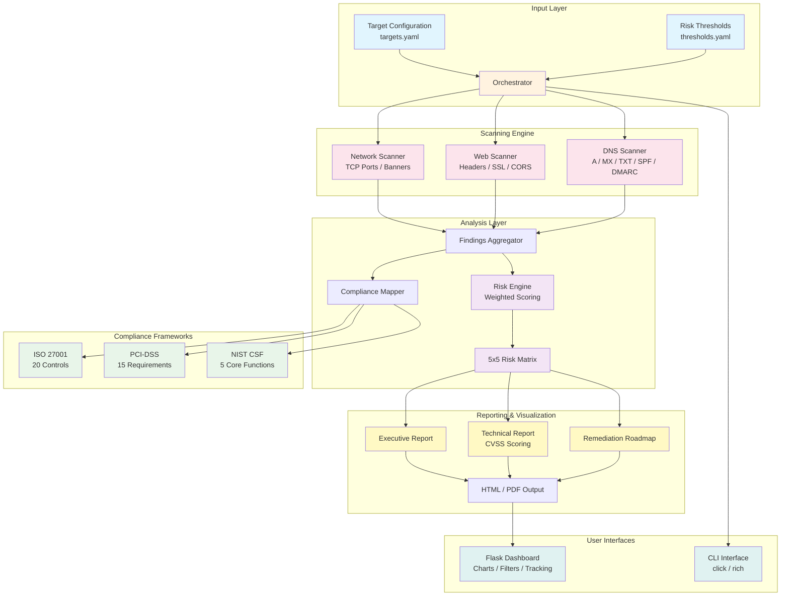
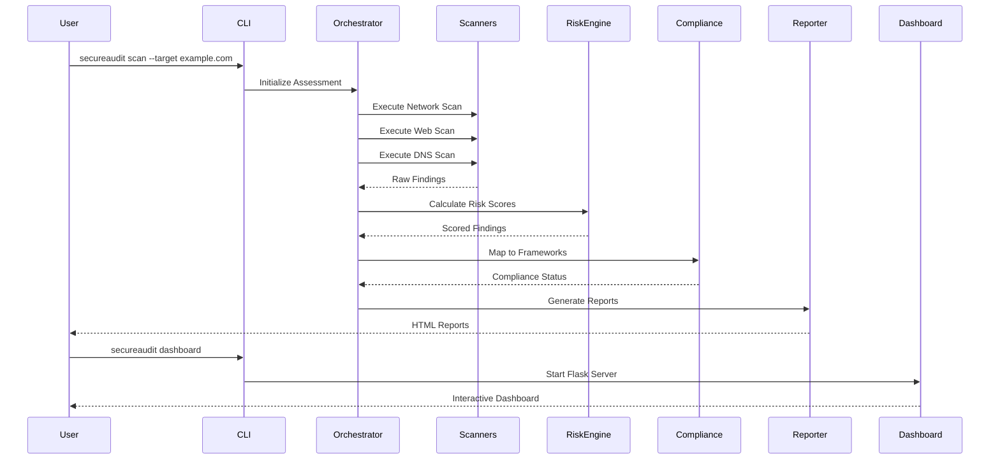

# SecureAudit Pro - Enterprise IT Security Assessment Platform

[](https://www.python.org/downloads/)
[](LICENSE)
[](https://peps.python.org/pep-0008/)
[](#)

> A production-grade, modular security assessment platform that automates network scanning, web application security analysis, compliance auditing (ISO 27001, PCI-DSS, NIST CSF), risk quantification, and executive-ready reporting -- all accessible through a polished web dashboard and powerful CLI.

---

## Table of Contents

- [Overview](#overview)
- [Architecture](#architecture)
- [Features](#features)
- [Quick Start](#quick-start)
- [Installation](#installation)
- [Usage Walkthrough](#usage-walkthrough)
- [Dashboard](#dashboard)
- [CLI Reference](#cli-reference)
- [Configuration](#configuration)
- [Project Structure](#project-structure)
- [Testing](#testing)
- [Ethical Guidelines](#ethical-guidelines)
- [Contributing](#contributing)
- [License](#license)

---

## Overview

**SecureAudit Pro** is a comprehensive IT security assessment platform designed for security professionals, IT auditors, and compliance teams. It provides an end-to-end workflow from reconnaissance through risk quantification to executive reporting.

### Why SecureAudit Pro?

| Challenge | Solution |
|-----------|----------|
| Manual security assessments are slow | Automated scanning pipeline with parallel execution |
| Compliance mapping is tedious | Pre-built control mappings for ISO 27001, PCI-DSS, NIST CSF |
| Risk communication is difficult | Visual risk matrices and executive-ready reports |
| Findings lack prioritization | Weighted risk engine with CVSS-aligned scoring |
| Remediation tracking is fragmented | Integrated roadmap with Quick Wins / Short-term / Long-term buckets |

---

## Architecture



### Data Flow



---

## Features

### Scanning Capabilities
- **Network Scanner**: TCP port scanning across configurable port ranges, service banner grabbing, open/closed/filtered port detection
- **Web Application Scanner**: HTTP security header analysis (HSTS, CSP, X-Frame-Options, etc.), SSL/TLS certificate validation, cookie security flags, CORS misconfiguration detection
- **DNS Scanner**: Complete DNS record enumeration (A, AAAA, MX, NS, TXT), SPF record validation, DMARC policy analysis, DNSSEC status

### Compliance Auditing
- **ISO 27001**: 20 key controls from Annex A with automated verification
- **PCI-DSS**: 15 critical requirements with pass/fail/partial scoring
- **NIST CSF**: All 5 core functions (Identify, Protect, Detect, Respond, Recover) mapped to actionable checks

### Risk Management
- **Weighted Risk Engine**: Calculates composite risk across 6 categories (Network, Application, Data, Compliance, Operational, Third-Party)
- **5x5 Risk Matrix**: Color-coded likelihood vs. impact visualization
- **CVSS-Aligned Scoring**: Findings scored on a 0-10 scale with severity classification

### Reporting
- **Executive Summary**: One-page overview with key metrics, risk posture, and top recommendations
- **Technical Report**: Detailed findings with evidence, CVSS scores, and remediation steps
- **Remediation Roadmap**: Prioritized action plan organized into Quick Wins (0-30 days), Short-term (30-90 days), and Long-term (90-365 days)

### Dashboard
- **Risk Overview**: Real-time risk posture with gauge charts and trend indicators
- **Findings Explorer**: Filterable, sortable findings table with severity badges
- **Compliance Status**: Framework-by-framework compliance percentage with drill-down
- **Remediation Tracker**: Progress tracking with timeline visualization

---

## Quick Start

```bash
# Clone and install
git clone <repository-url>
cd security-assessment-platform
pip install -r requirements.txt

# Configure your target
# Edit config/targets.yaml with your authorized target

# Run a full assessment
python -m src.cli full-assessment --target 127.0.0.1

# Launch the dashboard
python -m src.cli start-dashboard
# Open http://localhost:5000
```

---

## Installation

### Prerequisites
- Python 3.9 or higher
- pip package manager
- Network access to authorized target systems

### Step-by-Step Installation

```bash
# 1. Create a virtual environment (recommended)
python -m venv venv
source venv/bin/activate  # Linux/macOS
venv\Scripts\activate     # Windows

# 2. Install dependencies
pip install -r requirements.txt

# 3. Verify installation
python -m src.cli --help

# 4. Configure targets (IMPORTANT: only scan authorized systems)
cp config/targets.yaml config/targets.local.yaml
# Edit config/targets.local.yaml with your authorized targets
```

### Dependencies

| Package | Purpose |
|---------|---------|
| Flask | Web dashboard framework |
| Jinja2 | HTML report templating |
| Click | CLI framework |
| Rich | Terminal formatting and tables |
| PyYAML | Configuration file parsing |
| Requests | HTTP security scanning |
| dnspython | DNS record enumeration |

---

## Usage Walkthrough

### 1. Configure Your Target

Edit `config/targets.yaml`:

```yaml
targets:
  - host: "192.168.1.1"
    name: "Internal Web Server"
    scan_type: "full"
    ports: "1-1024"
```

### 2. Run Individual Scans

```bash
# Network scan
python -m src.cli scan-network --target 192.168.1.1 --ports 1-1024

# Web security scan
python -m src.cli scan-web --url https://example.com

# DNS enumeration
python -m src.cli scan-dns --domain example.com
```

### 3. Check Compliance

```bash
# Run all compliance checks
python -m src.cli check-compliance --framework all

# Run specific framework
python -m src.cli check-compliance --framework iso27001
python -m src.cli check-compliance --framework pci-dss
python -m src.cli check-compliance --framework nist-csf
```

### 4. Calculate Risk

```bash
python -m src.cli calculate-risk
```

### 5. Generate Reports

```bash
# Generate all reports
python -m src.cli generate-report --type all --output ./reports

# Generate specific report
python -m src.cli generate-report --type executive --output ./reports
python -m src.cli generate-report --type technical --output ./reports
python -m src.cli generate-report --type roadmap --output ./reports
```

### 6. Launch Dashboard

```bash
python -m src.cli start-dashboard --port 5000
```

### 7. Full Assessment Pipeline

```bash
# Run everything in sequence
python -m src.cli full-assessment --target 192.168.1.1 --output ./reports
```

---

## Dashboard

The web dashboard provides an interactive interface for exploring assessment results.

### Pages

| Page | Description |
|------|-------------|
| **Home** | Risk overview with gauge charts, severity distribution, and key metrics |
| **Findings** | Searchable, filterable table of all findings with severity badges |
| **Compliance** | Framework compliance percentages with control-level drill-down |
| **Remediation** | Prioritized action items with progress tracking |

### Launching

```bash
python -m src.cli start-dashboard --port 5000 --host 0.0.0.0
```

Navigate to `http://localhost:5000` in your browser.

---

## CLI Reference

```
Usage: python -m src.cli [OPTIONS] COMMAND [ARGS]...

Commands:
  scan-network      Perform TCP port scan and service detection
  scan-web          Analyze web application security headers
  scan-dns          Enumerate DNS records for a domain
  check-compliance  Run compliance checks against frameworks
  calculate-risk    Calculate weighted risk scores
  generate-report   Generate HTML assessment reports
  start-dashboard   Launch the web dashboard
  full-assessment   Run complete assessment pipeline
```

### Global Options

```
  --config PATH    Path to configuration file
  --verbose        Enable verbose output
  --output PATH    Output directory for results
  --help           Show help message
```

---

## Configuration

### targets.yaml

Defines scan targets with authorization metadata.

### thresholds.yaml

Configures risk scoring thresholds, severity definitions, and category weights.

---

## Project Structure

```
security-assessment-platform/
├── README.md                           # This file
├── LICENSE                             # MIT License
├── Makefile                            # Build automation
├── requirements.txt                    # Python dependencies
├── .gitignore                          # Git ignore rules
├── config/
│   ├── targets.yaml                    # Target configuration
│   └── thresholds.yaml                 # Risk thresholds
├── src/
│   ├── __init__.py
│   ├── cli.py                          # CLI entry point
│   ├── orchestrator.py                 # Assessment pipeline
│   ├── scanner/
│   │   ├── __init__.py
│   │   ├── network_scanner.py          # TCP port scanning
│   │   ├── web_scanner.py              # Web security analysis
│   │   └── dns_scanner.py              # DNS enumeration
│   ├── compliance/
│   │   ├── __init__.py
│   │   ├── iso27001.py                 # ISO 27001 controls
│   │   ├── pci_dss.py                  # PCI-DSS requirements
│   │   └── nist_csf.py                 # NIST CSF functions
│   ├── risk/
│   │   ├── __init__.py
│   │   ├── risk_engine.py              # Risk calculation
│   │   └── risk_matrix.py              # 5x5 risk matrix
│   └── reporting/
│       ├── __init__.py
│       ├── executive_report.py         # Executive summary
│       ├── technical_report.py         # Technical findings
│       ├── remediation_roadmap.py      # Remediation plan
│       └── templates/
│           ├── executive.html          # Executive HTML template
│           ├── technical.html          # Technical HTML template
│           └── roadmap.html            # Roadmap HTML template
├── dashboard/
│   ├── app.py                          # Flask application
│   ├── templates/
│   │   ├── index.html                  # Dashboard home
│   │   ├── findings.html              # Findings explorer
│   │   ├── compliance.html            # Compliance status
│   │   └── remediation.html           # Remediation tracker
│   └── static/
│       ├── css/
│       │   └── style.css              # Dashboard styles
│       └── js/
│           └── charts.js             # Chart.js visualizations
├── tests/
│   ├── __init__.py
│   ├── test_scanners.py               # Scanner tests
│   ├── test_compliance.py             # Compliance tests
│   ├── test_risk.py                   # Risk engine tests
│   └── test_reporting.py             # Reporting tests
└── docs/
    ├── ARCHITECTURE.md                 # System architecture
    ├── SCANNING_METHODOLOGY.md         # Scanning approach
    ├── COMPLIANCE_MAPPING.md           # Framework mappings
    ├── RISK_METHODOLOGY.md             # Risk methodology
    ├── REPORT_GUIDE.md                 # Report guide
    ├── DASHBOARD_GUIDE.md              # Dashboard guide
    ├── DEPLOYMENT.md                   # Deployment guide
    ├── ETHICAL_GUIDELINES.md           # Ethical use policy
    └── screenshots/
        └── SCREENSHOTS.md             # Screenshot catalog
```

---

## Testing

```bash
# Run all tests
python -m pytest tests/ -v

# Run specific test module
python -m pytest tests/test_scanners.py -v
python -m pytest tests/test_compliance.py -v
python -m pytest tests/test_risk.py -v
python -m pytest tests/test_reporting.py -v

# Run with coverage
python -m pytest tests/ --cov=src --cov-report=html
```

---

## Ethical Guidelines

**This tool is designed exclusively for authorized security assessments.**

- **Authorization Required**: Only scan systems you own or have explicit written permission to test
- **Responsible Disclosure**: Report vulnerabilities through proper channels
- **Data Protection**: Handle all assessment data as confidential
- **Legal Compliance**: Ensure all activities comply with applicable laws and regulations
- **Professional Conduct**: Follow industry codes of ethics (ISC2, ISACA, EC-Council)

See [docs/ETHICAL_GUIDELINES.md](docs/ETHICAL_GUIDELINES.md) for the complete ethical use policy.

---

## Contributing

We welcome contributions from the security community.

### How to Contribute

1. **Fork** the repository
2. **Create** a feature branch (`git checkout -b feature/amazing-feature`)
3. **Write** tests for your changes
4. **Ensure** all tests pass (`python -m pytest tests/ -v`)
5. **Follow** PEP 8 style guidelines
6. **Commit** your changes (`git commit -m 'Add amazing feature'`)
7. **Push** to the branch (`git push origin feature/amazing-feature`)
8. **Open** a Pull Request

### Development Setup

```bash
# Install dev dependencies
pip install -r requirements.txt
pip install pytest pytest-cov flake8 black

# Run linting
flake8 src/ tests/
black --check src/ tests/

# Run tests
python -m pytest tests/ -v --cov=src
```

### Code Standards

- All functions must have docstrings
- All modules must have module-level docstrings
- Test coverage should remain above 80%
- Follow the existing code patterns and naming conventions
- Security-sensitive code must include input validation

---

## License

This project is licensed under the MIT License. See [LICENSE](LICENSE) for details.

---

**Built for security professionals, by security professionals.**
